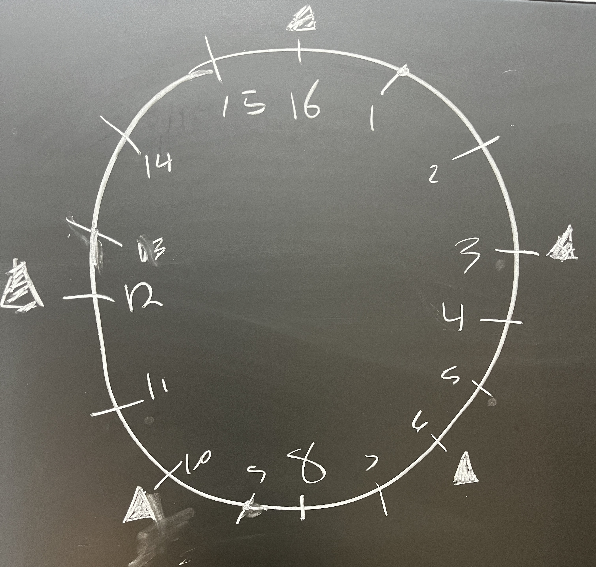
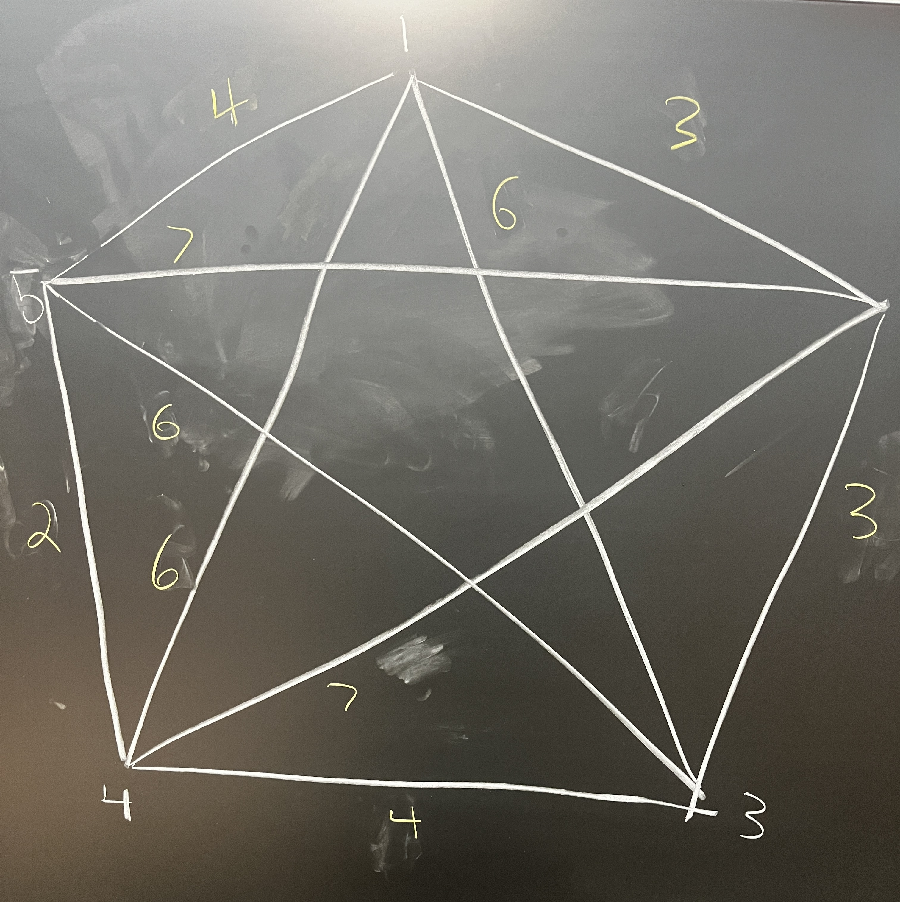
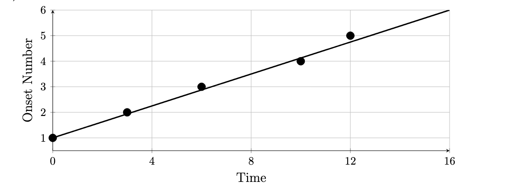
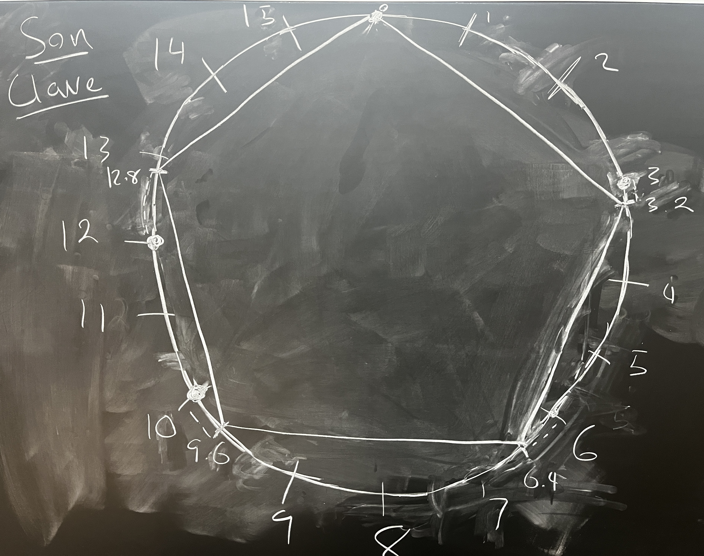

# Maximally Even Rhythms and Chord Coloring

**Author:** Jake Kerrigan  
**Course:** COMP 163  
**Date:** December 2025

---


### [Maximally Even Chord Colorer](https://jakedude18.pythonanywhere.com/)

For my project, I built a program to find maximally even chords using [Linear Regression Evenness](#Linear-Regression-Evenness). The user defines the base chord notes and a mode to "color" the chord with additional notes, then the implementation adds a specified amount of colored notes. The user can see their colored chord overlaid on the normal polygon used to calculate its evenness. Try it out using the link above!

### Functionality

Dynamic programming is used to assign each vertex of a normal polygon to a note in the chord, minimizing the distance from each vertex to its assigned note. The recursive subproblem is defined as follows (v = vertices of normal polygon, b = base notes, c = current coloring).  

```python
color(v, b, c) = 
    if v = 0: c
    elif v[0] < b: c + b[0]
    else: min(c + b[0], c + v[0], b[len(b) - 1] + c)
  
 ```

The last branch tries three diferent colorings by adding:
     1. the first base note
     2. the last base note
     3. the closest note in the mode (notated v[0]) 
It takes the one that leads to the smallest deviation from normal polygon
See chordColorer.py if interested in the heart of the coloring algorithm.

# All the methods below explore how to measure the evenness of rhythms and isomorphically chords. 

## Introduction

This paper is a structured report on Godfried Toussaint's work *"Computational Geometric Aspects of Rhythm, Melody, and Voice-Leading."* The goal is to summarize the core geometric models used to measure rhythmic (and chordal) evenness and interpret their mathematical and musical meaning.

More broadly, this paper explores how rhythms can be modeled using geometric and computational methods. A central idea is that rhythmic patterns can be represented as points arranged on a circle, allowing for the mathematical study of distance, symmetry, and evenness.

### Rhythmic forms and the Con Clave Rhythm

Different rhythm notations are used to describe the same rhythmic structure. Some useful ones include box-notation, binary sequences, interval-based, and geometric circular representations. 

As a simplified example, straight quarter notes in 4/4, or simply tapping your foot to a song, can be notated in box notation as:

[x...x...x...x...]

markdown
Copy code

Note the evenness of this rhythm—we'll revisit this shortly.

Godfried Toussaint introduces the Cuban *son* Clave rhythm as the motivating example. The *clave son* rhythm is represented in four different notations:

  

- **Geometric circular representation** (pictured above)  
- **Box form:** `[x..x..x...x.x...]` (each `x` = beat, each `.` = rest)  
- **Binary form:** `[1001001000101000]`  
- **Interval-based form:** `[3, 3, 4, 2, 4]` (distance between onsets)

We define its rhythm class as `R[5,16]`, which stipulates:  

- 5 onsets  
- 16 total pulses  

> Pulses = total number of slots in the rhythm not occupied by an onset  
> Onsets = number of beats/notes (assumed to have no duration; only starting point)

The term *clave* describes an abstract rhythm in the context of pulses and onsets.

---

## Measures of Rhythmic Evenness

For a rhythm to provide drive, as necessary in dance, it must be even: the audience shouldn’t be left waiting or bombarded with onsets. This section explores three methods of measuring evenness.

### Maximally Even Rhythms

A maximally even rhythm spaces all onsets as equally as possible. For example:

[x...x...x...x...]

perl
Copy code

To make maximal even rhythms less predictable, we consider rhythm classes `R[X,Y]` where `X` and `Y` are coprime. Distinct structures arise while maximizing evenness.

### Sum of Geodesic Evenness

This metric measures the distance between each onset along the circle (geodesics). For `n` onsets, there are `n choose 2` distances.  

The *con clave* rhythm has a geodesic evenness value of 48:



Example geodesic sums:

2 + 3 + 3 + 4 + 4 + 6 + 6 + 6 + 7 + 7 = 48

yaml
Copy code

However, this metric sometimes fails to distinguish rhythms that intuitively feel more even:

- Son: `[x..x..x...x.x...] = 48`  
- Rumba: `[x..x...x..x.x...] = 48`  
- Bossa-Nova: `[x..x..x...x..x..] = 48`  

### Sum of Distances Evenness

This metric uses Euclidean distance between onsets in geometric form:


Scores:

- Bossa: `[x..x..x...x..x..] = 15.3252`  
- Son: `[x..x..x...x.x...] = 15.2825`  
- Rumba: `[x..x...x..x.x...] = 15.2115`  
- Shiko: `[x...x.x...x.x...] = 15.1644`  
- Gahu: `[x..x..x...x...x.] = 15.1361`  
- Soukous: `[x..x..x...xx....] = 15.0096`  

This metric aligns more with intuition and captures evenness better.

### Linear Regression Evenness


Maximally even rhythms will deviate as little as possible from the regression line. But how do we measure deviation? We could choose vertical, horizontal, or orthogonal distance to the line. As we're measuring a deviation in time, the most fitting metric would be horizontal. Under this metric, we can imagine our regression line as a normal k-polygon in the n-pulse cyclic lattice. We can then calculate how much our rhythm deviates by calculating the geodesic distance of each onset to the nearest vertex of the normal polygon. The calculation is pictured below using the normal pentagon for the Son Clave rhythm:


Evenness scores (smaller = more even):

- Bossa: `[x..x..x...x..x..] = 1.2`  
- Son: `[x..x..x...x.x...] = 1.8`  
- Rumba: `[x..x...x..x.x...] = 2.0`  
- Shiko: `[x...x.x...x.x...] = 2.4`  
- Gahu: `[x..x..x...x...x.] = 2.2`  
- Soukous: `[x..x..x...xx....] = 2.8`  
